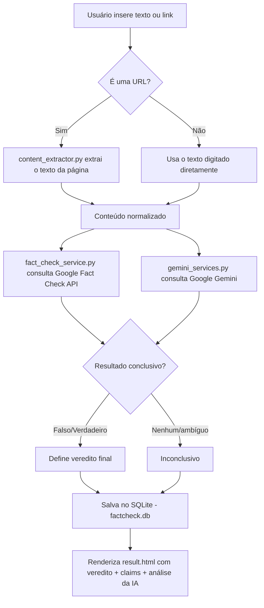

# Projeto Unifil — Sistema de Verificação de Fake News

<p align="center">
  
  
  
  
  
</p>

<p align="center">
  Aplicação web desenvolvida em <strong>Flask</strong> que recebe um texto ou link de notícia, extrai o conteúdo,
  cruza a informação com o <strong>Google Fact Check Tools API</strong> e utiliza a <strong>IA generativa do Google Gemini</strong>
  como camada de análise complementar (fallback), retornando um veredito (<em>Verdadeiro</em>, <em>Falso</em> ou <em>Inconclusivo</em>)
  e mantendo um histórico persistido em banco de dados <strong>SQLite</strong>.
</p>

---

## Sumário

- [Visão Geral](#-visão-geral)
- [Motivação](#-motivação)
- [Demonstração do Fluxo](#-demonstração-do-fluxo)
- [Arquitetura](#-arquitetura)
- [Stack Tecnológica](#-stack-tecnológica)
- [Estrutura de Pastas](#-estrutura-de-pastas)
- [Pré-requisitos](#-pré-requisitos)
- [Configuração (Variáveis de Ambiente)](#-configuração-variáveis-de-ambiente)
- [Rotas da Aplicação](#-rotas-da-aplicação)
- [Modelo de Dados](#-modelo-de-dados)
- [Detalhamento dos Serviços](#-detalhamento-dos-serviços)
- [Fluxo de Decisão do Veredito](#-fluxo-de-decisão-do-veredito)
- [Limitações Conhecidas](#-limitações-conhecidas)
- [Boas Práticas e Convenções](#-boas-práticas-e-convenções)
- [FAQ](#-faq)
- [Autor](#-autor)

---

## Visão Geral

O **Projeto Unifil** é uma aplicação web de **checagem de fatos (fact-checking)** criada como projeto acadêmico para a
**Universidade Filadélfia (UNIFIL)**. O sistema permite que o usuário insira:

- Um **texto** (uma afirmação, manchete ou trecho de notícia); ou
- Um **link (URL)** de uma matéria publicada na web.

A aplicação então:

1. Extrai o conteúdo textual (caso seja um link);
2. Consulta a **Google Fact Check Tools API** em busca de checagens já publicadas por agências de verificação parceiras do Google;
3. Envia o conteúdo para o **Google Gemini** como uma segunda camada de análise (IA generativa), atuando como *fallback* quando a busca factual não é conclusiva;
4. Consolida um veredito final (`Verdadeiro`, `Falso` ou `Inconclusivo`);
5. Persiste o resultado em um banco de dados **SQLite** (`factcheck.db`);
6. Exibe o resultado e mantém um **histórico** de todas as consultas já realizadas.

---

## Motivação

A desinformação (*fake news*) é um dos maiores desafios da era digital, impactando desde a saúde pública até processos
democráticos. Este projeto nasce da proposta acadêmica de explorar como **APIs de verificação de fatos** e **modelos de
linguagem (LLMs)** podem ser combinados para oferecer, de forma simples e acessível, uma primeira camada de triagem
sobre a veracidade de uma informação — sem substituir o trabalho humano e especializado de jornalistas e agências de
checagem, mas servindo como ferramenta de apoio e conscientização.

---

## Demonstração do Fluxo



---

## Arquitetura

A aplicação segue uma arquitetura **monolítica simples**, no padrão **MVC adaptado ao Flask**, dividida em camadas
bem definidas:

| Camada | Responsabilidade | Arquivo(s) |
|---|---|---|
| **Apresentação (View)** | Templates HTML renderizados via Jinja2 | `templates/*.html` |
| **Controle (Controller)** | Rotas HTTP e orquestração das chamadas | `app.py` |
| **Serviços (Service Layer)** | Regras de negócio e integração com APIs externas | `services/*.py` |
| **Persistência (Model/DAO)** | Conexão e schema do banco de dados | `database.py`, `factcheck.db` |
| **Estáticos** | CSS, imagens, JS do front-end | `static/` |

```
┌─────────────┐      HTTP       ┌──────────────┐
│  Navegador  │ ───────────────▶│   app.py     │
│ (Front-end) │ ◀─────────────── │  (Flask)     │
└─────────────┘     HTML        └──────┬───────┘
                                        │
                  ┌─────────────────────┼─────────────────────┐
                  ▼                     ▼                     ▼
        content_extractor.py   fact_check_service.py   gemini_services.py
        (newspaper3k/lxml)     (Google Fact Check API)  (Google Generative AI)
                  │                     │                     │
                  └─────────────────────┼─────────────────────┘
                                        ▼
                                  database.py
                                 (SQLite3 - factcheck.db)
```

---

## Stack Tecnológica

| Categoria | Tecnologia |
|---|---|
| **Linguagem** | Python 3.10+ |
| **Framework Web** | [Flask](https://flask.palletsprojects.com/) |
| **Banco de Dados** | SQLite 3 (via `sqlite3` nativo do Python) |
| **IA Generativa** | [Google Generative AI (Gemini)](https://ai.google.dev/) |
| **Verificação de Fatos** | [Google Fact Check Tools API](https://developers.google.com/fact-check/tools/api) |
| **Extração de Conteúdo Web** | [newspaper3k](https://github.com/codelucas/newspaper) + `lxml[html-clean]` |
| **Requisições HTTP** | [requests](https://docs.python-requests.org/) |
| **Variáveis de Ambiente** | [python-dotenv](https://pypi.org/project/python-dotenv/) |
| **Servidor WSGI (produção)** | [Gunicorn](https://gunicorn.org/) |
| **Front-end** | HTML5, CSS3, Jinja2 |

> 📊 Composição estimada do repositório: **HTML ~69%**, **Python ~17,5%**, **CSS ~13,5%**.

---

## Estrutura de Pastas

```
Projeto_Unifil/
│
├── services/                      # Camada de serviços / integrações externas
│   ├── content_extractor.py       # Extrai texto de URLs (newspaper3k)
│   ├── fact_check_service.py      # Integração com Google Fact Check Tools API
│   └── gemini_services.py         # Integração com Google Gemini (IA generativa)
│
├── static/                        # Arquivos estáticos (CSS, imagens, JS)
│
├── templates/                     # Templates Jinja2 (HTML)
│   ├── index.html                 # Página inicial / formulário de checagem
│   ├── sobre.html                 # Página "Sobre o projeto"
│   ├── fakenews.html              # Conteúdo educativo sobre fake news
│   ├── documentation.html         # Documentação interna da aplicação
│   ├── result.html                # Página de resultado da checagem
│   └── history.html               # Histórico de checagens realizadas
│
├── app.py                         # Ponto de entrada da aplicação Flask (rotas)
├── database.py                    # Conexão e inicialização do banco SQLite
├── factcheck.db                   # Banco de dados SQLite (gerado em runtime)
├── requirements.txt               # Dependências do projeto
├── Aliases                        # Atalhos/comandos auxiliares de execução
└── .gitignore                     # Arquivos/diretórios ignorados pelo Git
```

---

## Pré-requisitos

Como pré-requisitos antes de desenvolver a aplicação tive que adquirir as seguintes ferramentas:

- **Python 3.10 ou superior**
- **pip** (gerenciador de pacotes do Python)
- Uma **chave de API do Google Gemini** ([Google AI Studio](https://aistudio.google.com/app/apikey))
- Uma **chave de API do Google Fact Check Tools** (via [Google Cloud Console](https://console.cloud.google.com/))
- **virtualenv** ou **venv** para isolar as dependências

---


### Dependências (`requirements.txt`)

```text
flask
python-dotenv
requests
google-generativeai
newspaper3k
gunicorn
lxml[html-clean]
lxml_html_clean
```
## Rotas da Aplicação

| Método | Rota | Descrição |
|---|---|---|
| `GET` | `/` | Página inicial com o formulário de verificação |
| `GET` | `/sobre` | Página institucional sobre o projeto |
| `GET` | `/fakenews` | Conteúdo educativo sobre desinformação |
| `GET` | `/documentation` | Documentação técnica da aplicação |
| `POST` | `/check` | Recebe o texto/URL, processa a checagem e retorna o veredito |
| `GET` | `/history` | Lista o histórico de todas as checagens já realizadas |

### Exemplo de requisição — `POST /check`

```bash
curl -X POST http://127.0.0.1:5000/check \
  -d "text=https://exemplo.com/noticia-suspeita"
```

**Resposta:** renderização da página `result.html`, contendo:

- `claims` → lista de afirmações/checagens retornadas pela Google Fact Check API;
- `input` → texto/URL original enviado pelo usuário;
- `result` → veredito final (`Verdadeiro`, `Falso` ou `Inconclusivo`);
- `gemini` → análise textual gerada pela IA do Gemini.

---

## Modelo de Dados

O banco de dados SQLite (`factcheck.db`) possui atualmente uma tabela principal:

### Tabela `fact_checks`

| Coluna | Tipo | Descrição |
|---|---|---|
| `id` | `INTEGER PRIMARY KEY AUTOINCREMENT` | Identificador único do registro |
| `claim_text` | `TEXT NOT NULL` | Texto ou link original submetido pelo usuário |
| `result` | `TEXT NOT NULL` | Veredito calculado (`Verdadeiro` / `Falso` / `Inconclusivo`) |
| `created_at` | `TIMESTAMP DEFAULT CURRENT_TIMESTAMP` | Data/hora do registro da checagem |

Script de criação (executado em `database.py → init_db()`):

```sql
CREATE TABLE IF NOT EXISTS fact_checks (
    id INTEGER PRIMARY KEY AUTOINCREMENT,
    claim_text TEXT NOT NULL,
    result TEXT NOT NULL,
    created_at TIMESTAMP DEFAULT CURRENT_TIMESTAMP
);
```

---

## Detalhamento dos Serviços

### `services/content_extractor.py`
Responsável por receber uma URL e extrair seu conteúdo textual principal (título, corpo da matéria), utilizando a
biblioteca **newspaper3k** com suporte de parsing via **lxml**. Esse texto extraído é então repassado para as
etapas de verificação.

### `services/fact_check_service.py`
Realiza a integração com a **Google Fact Check Tools API**, consultando se a afirmação informada já foi checada por
alguma agência de fact-checking parceira do Google. Retorna o resultado normalizado (`result`) e a lista de
`claims` (afirmações relacionadas) encontradas.

### `services/gemini_services.py`
Camada de **fallback inteligente**: envia o conteúdo para o modelo **Google Gemini**, solicitando uma análise sobre
a veracidade da informação. O texto de retorno da IA é interpretado pela aplicação (`app.py`) para refinar o
veredito final, sobrepondo o resultado da Fact Check API quando o Gemini identifica explicitamente os termos
`"Falso"` ou `"Verdadeiro"` na resposta.

---
## Fluxo de Decisão do Veredito

A lógica de decisão implementada em `app.py` segue a seguinte prioridade:

1. **Detecção de URL:** se o conteúdo informado iniciar com `http`, o texto é extraído via `content_extractor`.
2. **Consulta primária:** o conteúdo é enviado à `check_fact_google()`, que retorna um resultado inicial e a lista
   de `claims`.
3. **Consulta secundária (IA):** o mesmo conteúdo é enviado à `analyze_with_gemini()`.
4. **Reconciliação:**
   - Se a resposta do Gemini contiver a palavra **"Falso"** → o veredito final é sobrescrito para `Falso`;
   - Se contiver **"Verdadeiro"** → o veredito final é sobrescrito para `Verdadeiro`;
   - Caso contrário → o veredito é definido como `Inconclusivo`.
5. **Persistência:** o par `(claim_text, result)` é salvo na tabela `fact_checks`.
6. **Renderização:** o usuário visualiza o resultado consolidado, incluindo a análise textual completa da IA.

> 💡 Essa abordagem de **duas camadas** (API de fact-checking + IA generativa) busca aumentar a cobertura de
> verificação, já que nem toda afirmação possui checagem prévia disponível publicamente.

## Limitações Conhecidas

- O banco de dados **SQLite** não é recomendado para alta concorrência em produção;
- A extração de conteúdo via `newspaper3k` pode falhar em sites com paywall, JavaScript pesado ou bloqueio de scraping;
- Resultados de IA generativa podem conter imprecisões — a ferramenta deve ser usada como **apoio**, não como
  fonte definitiva de verdade.

## Boas Práticas e Convenções

- Mantive as chaves de API **fora do controle de versão** (uso obrigatório do `.env` + `.gitignore`);
- Centralizei integrações externas dentro da pasta `services/`, mantendo `app.py` o mais "magro" possível (apenas
  orquestração de rotas);
- Ao adicionar novas tabelas, centralizei o schema em `database.py`;
---

## ❓ FAQ

**1. Preciso de chave de API para rodar o projeto localmente?**
Sim. São necessárias chaves válidas do Google Gemini e da Google Fact Check Tools API, configuradas no arquivo `.env`.

**2. O projeto funciona sem conexão com a internet?**
Não. Tanto a extração de notícias via URL quanto as consultas de fact-checking e IA dependem de serviços externos
online.

**3. Posso usar outro banco de dados além do SQLite?**
Sim, mas será necessário adaptar `database.py` para o driver do banco escolhido (ex: `psycopg2` para PostgreSQL).

**4. O resultado da IA é 100% confiável?**
Apesar de uma boa taxa de acerto, para assuntos mais complexos e ambiguos, o resultado pode não ser tão preciso e está sempre
passivel de melhora, por isso, o próprio sistema recomenda fontes confiáveis e credenciadas para maiores informações

---

## 👤 Autor

Desenvolvido por **[Pedro H. C. Rosa](https://github.com/PedroHcRosa)** como projeto acadêmico para a
**Universidade Filadélfia (UNIFIL)**.

<p align="center">
  <a href="https://github.com/PedroHcRosa">
    
  </a>
</p>

---

<p align="center">
  ⭐ Se este projeto te ajudou de alguma forma, considere deixar uma estrela no repositório!
</p>
